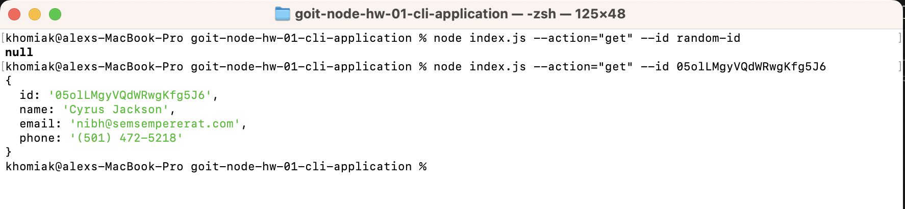
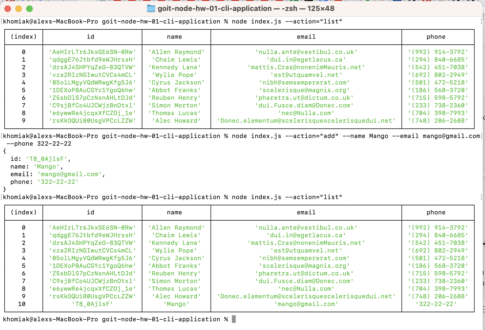
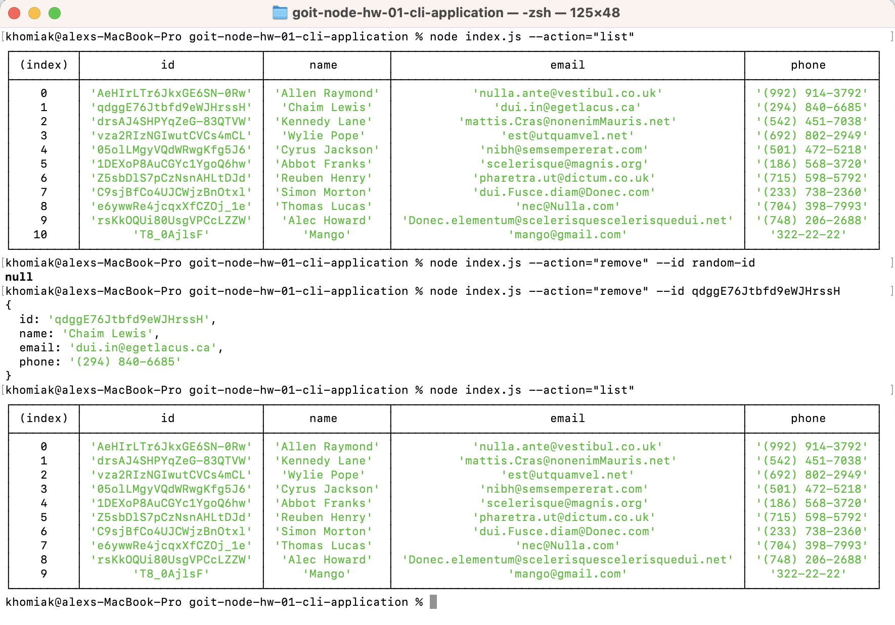

# Console Application "Contacts"

<b>1:</b> Отримуємо і виводимо весь список контактів у вигляді таблиці (console.table)

node index.js --action="list"

## 

<b>2:</b> Отримуємо контакт по id і виводимо у консоль об'єкт контакту або null, якщо контакту з таким id не існує.

node index.js --action="get" --id 05olLMgyVQdWRwgKfg5J6

## 

<b>3:</b> Додаємо контакт та виводимо в консоль об'єкт новоствореного контакту

node index.js --action="add" --name Mango --email mango@gmail.com --phone 322-22-22

## 

<b>4:</b> Видаляємо контакт та виводимо в консоль об'єкт видаленого контакту або null, якщо контакту з таким id не існує.

node index.js --action="remove" --id qdggE76Jtbfd9eWJHrssH

## 
